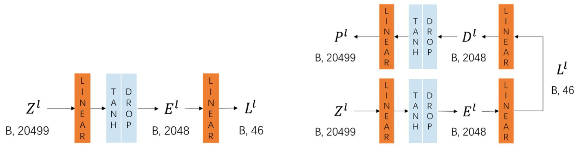
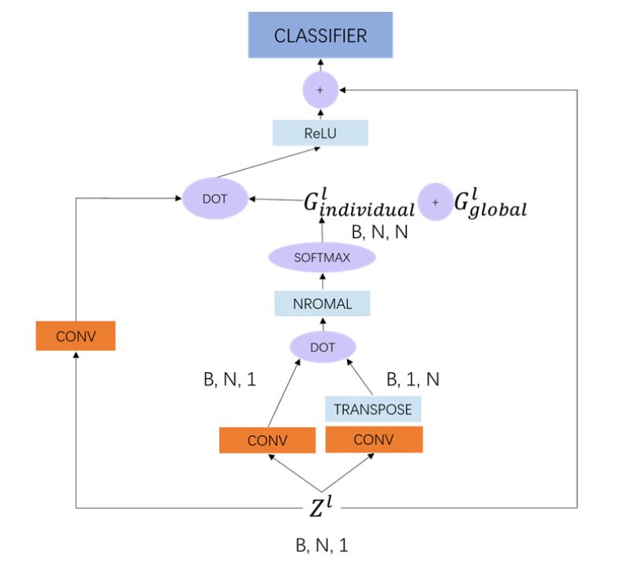

# Single cell RNA Sequence Classification with Neural Networks

Please refer to PDF file if the equation cannot be rendered right.

We built neural networks for classification. First of all, we train a fully connected classifier (FC) as a baseline for neural network models. But we find that results vary even of the same architecture. We reason such phenomenon to random weights initialization. Hence, to get better initialization weights, we train an AutoEncoder and use its encoder weights to initialize the FC weights. However, the result shows that AutoEncoder weights do not help much.

Also, with professor's help, we notice that the interactions between genes can assists classification, so building a gene interaction graph may help. However, the interaction graph is non-Euclidean as only $1817$ genes among total $20499$ genes interact. Therefore, a proper method is needed to learn the relationship between others.

Thanks to the invention of graph convolutional network(GCN), we can easily implement a model to learn the interaction between cells, which is proved to be helpful before feeding original feature to classifier.

## Methods

### FC classifier

First of all, to test whether neural networks perform well in our task, we implement a basic classifier which is composed of two hidden fully connected layers.

The final loss function is defined as The model can be trained with back-propagation. Combining with standard cross-entropy loss, the loss can be formed as

$$

\mathcal{L}=\mathcal{L}\left(y, \hat{y}\right)

$$

where $\mathcal{L}$ is the cross-entropy loss, $y$ and $\hat{y}$ denote the ground-truth and prediction labels of cells respectively.

### Initialization Weights

However, the results vary even for FCs with the same architecture. We assume that weight initialization may be the cause as we randomly generate initialization weights following a uniform distribution, which can be formed as

$$

W_0 \sim U[-\sqrt{\frac{1}{d_{in}}}, \sqrt{\frac{1}{d_{in}}}]

$$

where $W_0$ denotes the initialization weight and $d_{in}$ denotes the input feature dimension.

Hence, to gain better initialization weights, we implement an AutoEncoder which has the same FC architecture as its encoder and a symmetric FC architecture as its decoder. Combing with standard MSE loss, the loss can be formed as

$$

\mathcal{L}=\mathcal{L}(X,(\psi \circ \phi) X)

$$

where $\psi$ and $\phi$ denote the encoder and decoder respectively.

Figure 1: Fully Connected Classifier and AutoEncoder

### Feature smoothing with GCN

With professor's help, we note that modeling interactions between genes may help classification. So, for a single gene, if we can aggregate the features of other genes that are important to it, we can definitely get a better result.

**Graph Definition** Formally, the nodes in our graph correspond to a sequence of genes ${N}_{gene}=\left\{\mathbf{x}_{i} | i=1, \cdots, N\right\}$, where N is the number of genes, $\mathbf{x}_{i} \in \mathbb{R}^{d}$ is gene $i$’s feature. We construct graph $\mathbf{G} \in \mathbb{R}^{N \times N}$ to represent pair-wise interaction among genes, where interaction value $G_{ij}$ indicates the interaction score of gene $j$’s feature to gene $i$.

We found that only $1817$ genes out of the given $20499$ genes interact with some other genes actively with the help from STRING and BioGRID. So we can assume that the interaction graph is sparse and non-Euclidean.

**Interaction Graph** To compute interaction score between genes, we adopt *embedded dot-product* to compute similarity in an embedding space, and the corresponding function can be expressed as:

$$

f\left(\mathbf{x}_{i}, \mathbf{x}_{j}\right)=\frac{\theta\left(\mathbf{x}_{i}\right)^{\mathrm{T}} \phi\left(\mathbf{x}_{j}\right)}{\sqrt{d_{k}}}

$$

where $\theta\left(\mathbf{x}_{i}\right)=\mathbf{W}_{\theta} \mathbf{x}_{i}+\mathbf{b}_{\theta}$ and $\phi\left(\mathbf{x}_{i}\right)=\mathbf{W}_{\phi} \mathbf{x}_{i}+\mathbf{b}_{\phi}$ are two learnable linear transformations. $\mathbf{W}_{\theta} \in \mathbb{R}^{d_{k} \times d}$ and $\mathbf{W}_{\phi} \in \mathbb{R}^{d_{k} \times d}$ are weight matrices. $\mathbf{b}_{\theta} \in \mathbb{R}^{d_{k}}$ and $\mathbf{b}_{\phi} \in \mathbb{R}^{d_{k}}$ are weight vectors. By learnable transformations of original features, we can learn the interaction score between two genes.

In our experiments, we also adopt the following function to compute relation value:

$$

\mathbf{G}_{i j}=\frac{ \exp \left(f\left(\mathbf{x}_{i}, \mathbf{x}_{j}\right)\right)}{\sum_{j=1}^{N} \exp \left(f\left(\mathbf{x}_{i}, \mathbf{x}_{j}\right)\right)}

$$

where we perform normalization on each gene node using softmax function so that the sum of all the interaction scores of one gene $i$ will be $1$.

**GCN module** We turn to GCN for reasoning the interaction among genes. The GCN module takes gene feature as input, computes over the input, and returns a smoothed feature as output, which aggregates the features among all the other genes. Formally, the GCN module can be written as: 

$$

\mathbf{Z}=\sigma\left(\mathbf{G} \mathbf{Z} \mathbf{W}\right)

$$

where $\mathbf{G} \in \mathbb{R}^{N \times N}$ is the matrix representation of the interaction graph. $\mathbf{Z} \in \mathbb{R}^{N \times d}$ denotes the feature of genes. $\mathbf{W} \in \mathbb{R}^{d \times d}$ represents the learnable weight matrix. $\sigma(\cdot)$ denotes an activation function, and we use ReLU in this task.

**Residual Connection** Finally the output smoothed features from GCN are fused with original features via summation to form the final feature. By doing so, we keep the initial feature information and combine it with the smoothed feature from GCN, which assists following classifier to predict cell labels.

**Individual and Global Graph** In addition to the interaction graph computed by *embedded dot-product* for every batch(individually), we also introduce global graph, which is built according to interaction scores given by STRING. We also add normalize these scores by dividing the maximum score, which keeps the scores under $1$ and can thus be compatible with individual graph.

As the interactive graph is extremely sparse, it may be hard for the individual graph alone to model interaction relationship between genes. And the GCN module over it can have a hard time learning from the input feature. Hence, the global graph, built with prior knowledge, can help the GCN module to learn the interaction between genes with biology knowledge. 

Next, the output smoothed features from GCN are fused with original features via summation to form the final feature. By doing so, we keep the initial feature information and combine it with the smoothed feature from GCN, which assists following classifier to predict cell labels.

Finally, As illustrated in the following figure, the fused feature is fed to FC classifier to generate cell predictions. The whole model can be trained with back-propagation. And we use cross-entropy loss to compute loss.

Figure N: Feature Smoothing with Graphic Convolution Network

## Results

First of all, we experiment on FC with random initialization mentioned before and with weights from AutoEncoder, the result is shown as below:

| Initialization | Test Accuracy |
| :-----------: | :-----------: |
| Random | $51.48\%$ |
| Autoencoder | $48.68\%$ |

As shown above, we can find that the AutoEncoder weights does not help much in terms of classification. We think that the feature extracted for restoring original one differs a lot from that is used for classification.

Next, we experiment on feature smoothing with GCN, the result is shown as follows:

| Classfier | Global Graph | Input Dimension | Test Accuracy |
| :-----------: | :-----------: | :-----------: | :-----------: |
| FC | | $20499$ | $52.36\%$ |
| FC | Normalized Graph | $20499$ | $53.1\%$ |
| FC | Normalized Diagonal Graph | $20499$ | $51.73\%$ |
| FC | | $1817$ | $49.98\%$ |
| FC | Normalized Graph | $1817$ | $47.46\%$ |
| FC | Normalized Diagonal Graph | $1817$ | $47.43\%$ |

For all the experiments above, we use FC as classifiers. It's not surprising that the experiments with global graph outperform others as the global graph brings some prior biology knowledge for classification.

And for the ones with global graph, we set the diagonal value to $0$ and $1$. By setting the diagonal to $0$, the genes can focus on other genes instead of just concentrating on themselves and vice versa. According to the results, we can find that focusing on other genes can actually assist classification.

Also, we tried to select $1817$ genes out of all the genes. The genes selected have interaction scores according to STRING. By doing so, we can make the interaction graph denser and the learning process quicker. But at the same time, such feature selection methods remove some potential relationship between genes, and these relationships can play an important role when it comes to classification. Hence, the ones with selected features as input do worse than others.

For all of the experiments above, We adopt ADAM optimizer to learn the network parameters and fix hyper-parameters to $\beta_{1}=0.9$, $\beta_{2}=0.999$, $\epsilon=10^{-8}$.

The batch size of FC is set to $64$ while for GCN, batch size is set to $1$. Our implementation is based on PyTorch deep learning framework. And all of the experiments are implemented on a Tesla P40 GPU.

## Conclusions

According to the experiments shown above, we can conclude that using original feature for classification is better than using selected ones. That may be because when performing selecting operations, we not only remove the feature themselves, but also the potential relationship between them and the kept ones.

Also, we have to admit that the interaction score given by STRING does not represent all the features that is helpful for classification. Hence, selecting features based only on interaction score can never give us enough information for classification.

With the help of GCN, we can conclude that it's important for genes to focus on others instead of just focusing on themselves. And by aggregating the information from other gene features, the single gene can gain a better understanding of the global circumstances and utilizing the features from other genes.

**Future Work** We have to admit that the experiments we have done is not complete. In the future, we can complete the GCN module by experiment on different attention methods to learn the individual graph. Also, it we have enough GPU memory, we can stack more GCN modules to learn multiple graph at the same time. What's more, more layers of GCN module in a line may improve the final classification as well.

## References

Hinton, G. E., \& Zemel, R. S. (1994). Autoencoders, minimum description length and Helmholtz free energy. In Advances in neural information processing systems (pp. 3-10)

Kaiming He, Xiangyu Zhang, Shaoqing Ren \& Jian Sun.(2015) Deep residual learning for image recognition. arXiv preprint arXiv:1512.03385

Thomas N. Kipf \& Max Welling.(2016) Semi-supervised classification with graph convolutional networks. CoRR, abs/1609.02907

Ashish Vaswani, Noam Shazeer, Niki Parmar, Jakob Uszkoreit, Llion Jones, Aidan N. Gomez, Lukasz Kaiser \& Illia Polosukhin.(2017) Attention is all you need. In NIPS, pages 6000–6010

J. Wu, L. Wang, L. Wang, J. Guo, and G. Wu. (2019). Learning Actor Relation

Graphs for Group Activity Recognition. In IEEE Conference on Computer Vision and Pattern Recognition

Szklarczyk D, Gable AL, Lyon D, Junge A, Wyder S, Huerta-Cepas J, Simonovic M, Doncheva NT, Morris JH, Bork P, Jensen LJ, von Mering C.(2019) STRING v11: protein-protein association networks with increased coverage, supporting functional discovery in genome-wide experimental datasets. Nucleic Acids Res. Jan; 47:D607-613
